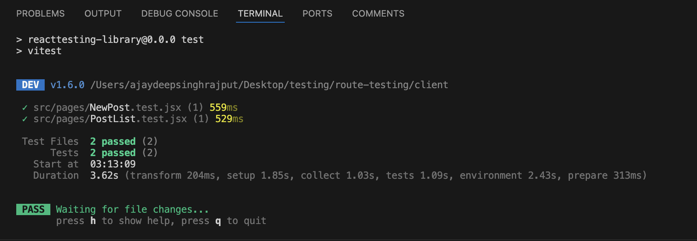

# Instructions

1. Test that the filtering on the `PostList` page works as expected. This will require quite a bit or API mocking, and is a rather large test. You should make sure you test that it works with no filter, as well as that each of the filter fields work.
2. Test that the `NewPost` page works when creating a post. This again will require lots of API mocking, and will even deal with navigating to new pages.

